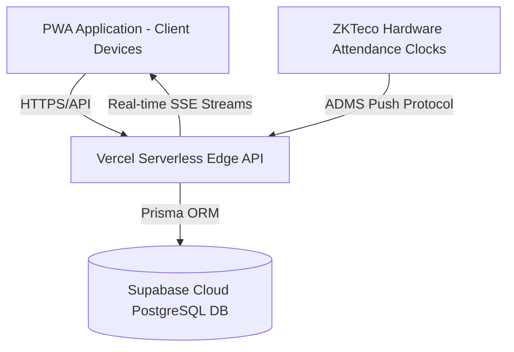

# 📱 منظومة تطبيق البصمة الذكي (Basma Attendance System - 2026 Edition)
> **تقرير النشر الفعلي ومستند الدليل الفني والتشغيلي لعام 2026**

---

## 📌 1. الملخص التنفيذي ورابط المنظومة الحية (Production Deployment)

تم تطوير وتحديث وتفعيل منظومة **بصمة (Basma Attendance System)** بنجاح لتعمل بصورة إنتاجية كاملة وفق أعلى معايير الأمان وحماية البيانات لعام 2026. المنظومة مربوطة بقواعد بيانات سحابية متقدمة على **Supabase PostgreSQL** ومستضافة ومبثوقة على منصة **Vercel Edge Platform**.

* 🌐 **رابط المنظومة المباشر على الإنتاج (Vercel Live URL)**:
  👉 [https://basma-attendance-gold.vercel.app](https://basma-attendance-gold.vercel.app)
* 🔐 **حساب الإدارة والتحكم**:
  * البريد الإلكتروني الرسمي: `admin@basma.com`
  * كلمة المرور: محصنة ومحفورة عبر سياسة كلمات المرور القوية (Password Policy Enabled)

---

## 🚀 2. أبرز الميزات المحسّنة والحلول التقنية المنجزة

### 🛡️ أ. ربط واقتران الجهاز الموثوق (Trusted Device Binding Lock)
* تقييد حساب الموظف بالهاتف الجوال الخاص به فقط ومنع التبصيم من أي جهاز آخر.
* إمكانية فك اقتران الأجهزة من لوحة الإدارة تمكيناً للموظفين عند تغيير هواتفهم.

### 📍 ب. نظام النطاق الجغرافي الخادم (Server-Side Geofencing Engine)
* التحقق من تواجد الموظف داخل النطاق المصرح به للفرع قبل قبول الحضور أو الانصراف.
* رفع مرونة دقة الـ GPS إلى **(50-80 متراً)** لمنع الأخطاء الوهمية داخل المباني والمكاتب المغلقة.
* تسجيل وتوثيق أي محاولة خارج نطاق الفرع فوراً في تقرير المحاولات المشبوهة.

### 🔐 ج. خيار رمز التأكيد المزدوج (OTP Verification Toggle)
* ربط رمز التأكيد المكون من 6 أرقام بإعدادات المنظومة `enableVerificationOtp`.
* يتيح للمسؤول إلغاء تفعيل الرمز لسرعة الحضور بلمسة واحدة أو تفعيله في المنشآت عالية الأمان.

### ⏰ د. باني الورديات المتقدم وتناوب يوم الجمعة (2026 Shift Builder Engine)
* دعم الورديات الثابتة، المرنة، والوردية المنقسمة (Split Shift).
* إضافة خيار تناوب وردية يوم الجمعة (تناوب صباحي / مسائي / إجازة) والعطل الرسمية.

### 📱 هـ. واجهة مستخدم ناصعة واستجابة كاملة للهواتف (Clean Mobile & Tablet UI)
* معالجة كافة مشاكل التنسيق والاكتمال والتنقل السلس.
* تنظيف شريط الأدوات العلوي وإزالة التكرار لضمان أداء سلس وسريع بدقة 100%.
* تحويل بطاقات الإحصائيات (حاضر، غائب، متأخر، محاولات مشبوهة) إلى أزرار تفاعلية فورية.

---

## 📊 3. تقرير التدقيق وسجل المحاولات المشبوهة (Suspicious Audit Log)

يشتمل التقرير الجديد والمستقل للمحاولات المشبوهة على البيانات التالية لضمان الشفافية الكاملة أمام الإدارة:

| العنصر | الوصف والتشخيص |
| :--- | :--- |
| **الموظف** | اسم الموظف ورقمه الوظيفي المقترن بالحساب |
| **سبب الحظر** | تشخيص باللغة العربية (📍 خارج النطاق الجغرافي / 📱 جهاز غير معتمد / 📡 ضعف دقة الـ GPS) |
| **مستوى الخطورة** | تقييم الخطر (`⚠️ عالي الخطورة` / `⚡ متوسط`) |
| **إحداثيات الـ GPS** | خطوط الطول والعرض الدقيقة ودقة الإشارة بالمتر |
| **الإجراء المتخذ** | حظر التبصيم التلقائي المباشر (`🛡️ BLOCKED`) |
| **التوقيت والتاريخ** | التاريخ والوقت الدقيق للمحاولة |

---

## 🛠️ 4. الهندسة البرمجية وهيكلية المشروع (System Architecture)

* **Frontend**: Next.js 14 (App Router) + Tailwind CSS + Lucide Icons.
* **Backend API**: Next.js Serverless Route Handlers (`/api/...`).
* **Database**: PostgreSQL Hosted on Supabase Cloud, managed via Prisma ORM.
* **Hardware Integration**: ZKTeco Push ADMS Listener Route (`/api/hardware/zkteco/iclock`).

---

## 📋 5. قائمة المسارات والصفحات الرئيسية (Project Routes)

* 🏠 `/` : بوابة الموظف للتبصيم اليومي، طلبات الإجازة وتصحيح البصمة.
* 🔐 `/login` : صفحة تسجيل الدخول الموحدة للموظفين والإدارة.
* 📊 `/admin` : لوحة التحكم الإدارية، النشاط المباشر، الفروع، وتقارير المحاولات المشبوهة.
* ⏰ `/admin/shifts` : باني ومحرك الورديات المتقدم وإعدادات أيام الدوام والجمعة.
* 📋 `/admin/tasks` : نظام إسناد ومتابعة مهام الموظفين.
* 📱 `/admin/devices` : اعتماد وتوثيق الهواتف المقترنة للموظفين.

---

## ✅ 6. ختام وتأكيد جاهزية النظام

جميع التحديثات المذكورة أعلاه مفعلة ومجربة وتعمل بصورة حية على سيرفر الإنتاج:
🔗 **[https://basma-attendance-gold.vercel.app](https://basma-attendance-gold.vercel.app)**
